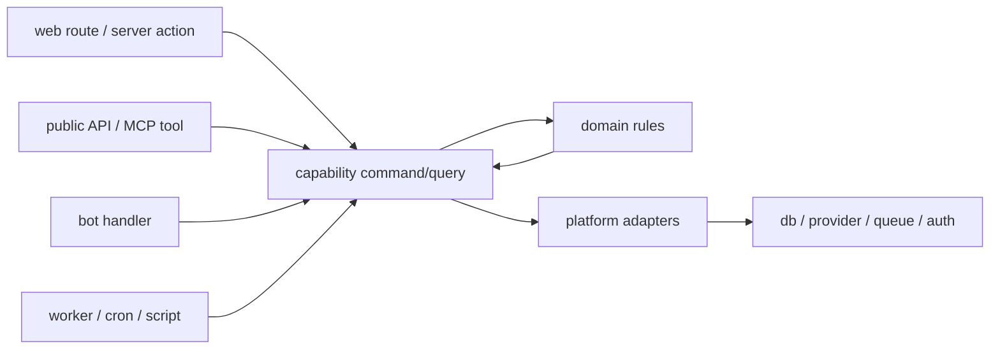

# Capability Core + Adapters

**A default structure for projects where one behavior starts being used by web
routes, API handlers, bots, jobs, scripts, MCP tools, mobile apps, or desktop
apps.**

Capability Core + Adapters is for the moment when a project has outgrown
"put the logic in the route" but does not need a microservice split or a heavy
architecture template.

```txt
web route
bot handler
worker job       ->  one capability command/query  ->  domain rules  ->  platform adapters
public API
CLI script
```

## The problem

Example starting point:

```txt
web route -> validate input -> update db -> call provider -> return UI state
```

That is fine until the same behavior gets another entrypoint:

```txt
web route      -> validate input -> update db -> call provider -> return UI state
bot handler    -> parse message  -> update db -> call provider -> return bot reply
retry job      -> load failed row -> update db -> call provider -> mark status
public API     -> validate JSON  -> update db -> call provider -> return JSON
repair script  -> read ids       -> update db -> call provider -> print result
```

Now several files can make the same business decision. They can drift:

- one path validates differently;
- one path calls the provider directly;
- one path writes a status the UI cannot explain;
- one path bypasses retry or permission rules;
- one shared component hides different business meanings.

Capability Core + Adapters gives that behavior one owned path:

```txt
web route      \
bot handler     \
retry job        -> createBookingLink() -> booking policy -> provider/db adapters
public API      /
repair script  /
```

The point is not the folder names. The point is that every entrypoint stops
inventing its own version of the behavior.

## Why this matters for agents

Coding agents make this drift faster when the project does not tell them where
behavior belongs.

Common agent failures:

```txt
agent sees route file      -> adds business logic there
agent sees shared folder   -> adds product-specific helper there
agent sees failing job     -> patches job path only
agent lacks context        -> creates a second command instead of finding the first
agent follows stale docs   -> preserves the wrong boundary
```

This framework gives agents a retrieval and placement routine:

```txt
1. find existing architecture and capability docs
2. name the capability and entrypoints
3. locate source of truth and authority
4. reuse or extract the command/query path
5. update the capability contract when behavior changes
6. verify every touched entrypoint
```

The goal is not to make agents more autonomous. The goal is to make their
default move less destructive.

## What is being compared

| Approach | Good at | Breaks down when |
| --- | --- | --- |
| Framework routes only | Fast start in Next, TanStack Start, Remix, SvelteKit | Bot, job, API, or script needs the same behavior |
| Frontend feature slicing | Organizing UI and client state | Durable backend truth and jobs need the same rules |
| Shared utilities | Reusing primitives | Product semantics get hidden in `shared` |
| Clean/Hexagonal Architecture | Strong boundaries | Too much ceremony for the first slice |
| Microservices | Independent deployment and scaling | Domain ownership is not clear yet |
| Capability Core + Adapters | One behavior path across entrypoints | Existing architecture already answers the ownership question |

## Philosophy

This repository presents Capability Core + Adapters as a sane default, not a
universal law.

Use it when a project has no clear architecture, when entrypoints are starting
to multiply, or when agents and humans need a shared decision framework. If a
team already has a coherent architecture that explains ownership, source of
truth, and boundaries, keep it. Borrow only the parts that clarify the work.

Use the framework only while it clarifies ownership. If adoption creates
ceremony without clarifying ownership, narrow the effort or stop.

This posture is aligned with small-step, behavior-preserving refactoring and
avoid-hasty-abstraction guidance: change one concrete slice, test it, and avoid
promoting abstractions before the reason to change is clear.

## Evidence boundary

This repository is a design proposal and operating checklist. It is not a
benchmark, a formal study, or proof that one structure fits every codebase.

The claims here are intentionally narrower:

- the repo defines a vocabulary for entrypoints, capabilities, domain,
  contracts, platform, and shared primitives;
- the docs give placement rules for humans and agents;
- the examples show common drift patterns and one way to correct them;
- the method should be adopted only when it clarifies ownership in a real slice.

If a team already has stronger local evidence or a better architecture, that
local system wins.

## The model



```txt
apps / inbound adapters
  Next routes, TanStack server functions, Remix actions, REST, bot handlers,
  MCP tools, Trigger.dev jobs, cron, CLI, desktop IPC, mobile bridges

capabilities
  product workflows: commands, queries, view models, use cases

domain
  durable truth: policies, invariants, lifecycle, reconciliation, authority

contracts
  API, event, job, and cross-deployable schemas

platform
  database, external APIs, SDKs, queues, auth, telemetry, file storage

shared
  primitives: design system, generic helpers, boring utilities
```

Default flow:

```txt
inbound adapter -> capability command/query -> domain -> platform
```

Use the same model at different sizes:

```txt
small app:
  src/app -> src/capabilities -> src/domain -> src/platform

monorepo:
  apps/web, apps/bot, apps/worker -> packages/capabilities -> packages/domain

backend-heavy system:
  api, worker, bot, MCP -> modules/<bounded-context>/capabilities -> domain/platform
```

## Quick start

Try it on one behavior first.

```txt
1. Pick one capability in product language.
2. List every entrypoint that touches it.
3. Name the source of truth and authority.
4. Extract one command/query or thin one adapter.
5. Test the command/query/domain rule.
6. Stop if the move does not clarify ownership.
```

For a small full-stack app:

```txt
src/
  app/              # routes, pages, server actions, loaders, handlers
  capabilities/     # product workflows
  domain/           # truth and invariants
  platform/         # db, SDKs, queues, external APIs
  shared/           # primitives
```

For a monorepo:

```txt
apps/
  web/
  api/
  bot/
  worker/
  desktop/
  scripts/

packages/
  capabilities/
  domain/
  contracts/
  platform/
  ui/
```

The recommended adoption path is local first. Promote code only when the reason
to change is genuinely shared.

## What makes this different

This repo does not present Capability Core + Adapters as "Feature-Sliced Design
for the backend" or as a strict Clean Architecture template.

It is an ownership framework:

- framework routes own entrypoints;
- capabilities own behavior;
- domain owns truth;
- contracts own boundaries;
- platform owns infrastructure;
- shared owns primitives.

That distinction matters when a project grows from one UI into several clients,
jobs, scripts, APIs, and external integrations.

## When to use it

Use it when:

- adding a second entrypoint to existing behavior;
- building a full-stack app that may later grow beyond one UI;
- refactoring route handlers, server actions, bot handlers, or jobs with
  duplicated business logic;
- designing public APIs, MCP tools, background workers, or scripts that touch
  existing state;
- reviewing ambiguous "shared" UI or utility code;
- preparing a project for agent-assisted development.

Do not use it as an excuse for a global folder reshuffle. Apply it one
capability at a time.

## When not to use it

Do not force this framework when:

- the project already has a clear architecture with working boundaries;
- the codebase is a small throwaway script or prototype;
- the real problem is domain discovery, not code organization;
- the team needs a specialized architecture for safety, regulation,
  performance, or distributed systems;
- applying the framework would only rename folders without changing ownership.

## Documentation

- [Getting started](docs/getting-started.md)
- [Problem map](docs/problem-map.md)
- [Agent operating model](docs/agent-operating-model.md)
- [Framework](docs/framework.md)
- [Full-stack boundaries](docs/full-stack-boundaries.md)
- [Decision guide](docs/decision-guide.md)
- [Adoption playbook](docs/adoption-playbook.md)
- [Limits and failure modes](docs/limits-and-failure-modes.md)
- [Method fit checklist](docs/method-fit-checklist.md)
- [Agent skill pack](docs/skill-pack.md)
- [Comparison with related patterns](docs/comparison.md)

## Examples

- [Next BFF to multi-entrypoint](examples/01-next-bff-to-multi-entrypoint/README.md)
- [Shared UI, different semantics](examples/02-shared-ui-different-semantics/README.md)
- [Backend-heavy service](examples/03-backend-heavy-service/README.md)
- [First adoption run](examples/04-first-adoption-run/README.md)

## Templates

- [Capability contract](templates/capability-contract.md)
- [Adoption checklist](templates/adoption-checklist.md)
- [Agent instructions snippet](templates/agents-snippet.md)
- [Architecture decision record](templates/adr.md)

## Optional agent skills

This repository includes optional `SKILL.md` packages for Claude Code, Codex,
and compatible coding agents:

```txt
skills/
  capability-core-adapters/
  capability-contract/
```

The docs are the source of truth. Skills are thin entrypoints that help agents
apply the framework consistently.

## One-sentence rule

Every new entrypoint is an adapter. It may call existing capability commands and
queries, but it does not get to invent a new copy of the business logic.

## Further reading

- [Martin Fowler: Refactoring](https://refactoring.com/)
- [Kent C. Dodds: AHA Programming](https://kentcdodds.com/blog/aha-programming)
- [Sandi Metz: The Wrong Abstraction](https://sandimetz.com/blog/2016/1/20/the-wrong-abstraction)

## License

MIT. Use it, fork it, adapt it, and improve it.
